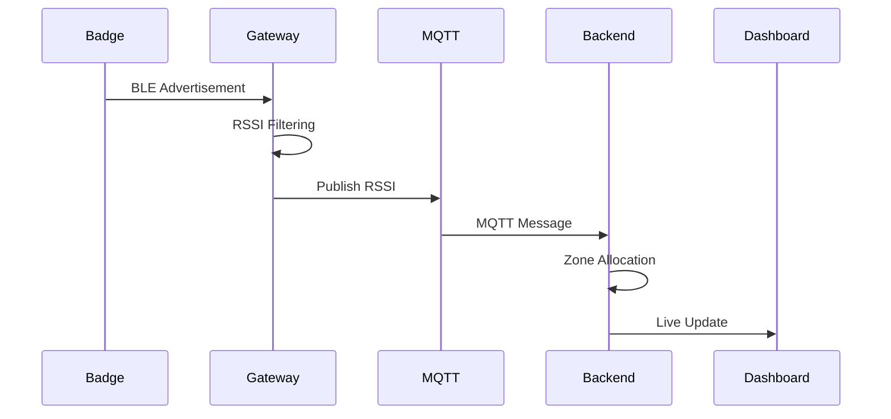

# 🛰️ Smart Indoor Occupancy Tracking System

<p align="center">


</p>

---

## 📸 Project Banner

> Replace this image with your project photo.

<p align="center">


</p>

---

# 📖 Overview

Indoor positioning has always been one of the biggest challenges in IoT.

GPS performs exceptionally outdoors but becomes unreliable inside buildings because satellite signals cannot accurately penetrate walls and ceilings.

This project solves that problem using **Bluetooth Low Energy (BLE)**, **ESP32 microcontrollers**, **MQTT communication**, and intelligent **RSSI-based zone detection**.

Instead of estimating an exact X-Y coordinate, the system determines **which room or zone a person currently occupies**, making it ideal for:

🏢 Offices

🏫 Colleges

🏥 Hospitals

🏭 Factories

🏨 Hotels

🏠 Smart Buildings

Every person carries a small ESP32 badge that continuously broadcasts BLE packets.

Multiple ESP32 Gateways listen to these packets, measure their RSSI values, filter signal noise, publish the information to an MQTT broker, and finally a backend server determines the correct room before updating a real-time web dashboard.

---

# 🎯 Objectives

✅ Indoor location tracking

✅ Room-level accuracy

✅ Low-cost implementation

✅ Easy scalability

✅ Real-time updates

✅ Wireless communication

✅ Low power wearable badge

✅ Live occupancy dashboard

---

# ✨ Features

## 📡 BLE Wearable Badge

- Broadcasts BLE advertisements
- Unique MAC address
- Battery powered
- Portable
- Low power consumption

---

## 📶 ESP32 Gateways

- Continuous BLE scanning
- RSSI collection
- Median filtering
- EMA filtering
- MQTT publishing
- Automatic WiFi reconnect
- MQTT reconnect

---

## 📊 Intelligent Backend

- Receives RSSI from all gateways
- Compares signals
- Detects strongest gateway
- Applies hysteresis
- Prevents rapid switching
- Updates dashboard instantly

---

## 🌐 Live Dashboard

Displays

👤 User Name

🪪 Badge ID

📍 Current Zone

📶 RSSI

🟢 Online Status

🕒 Last Seen

---

## ⚡ Smart Filtering

Indoor RSSI fluctuates heavily because of:

🚶 Human movement

🧱 Walls

🪟 Glass

🪑 Furniture

📡 Reflection

📶 Multipath

To overcome this, our project uses:

✅ Median Filter

✅ Exponential Moving Average (EMA)

✅ Hysteresis Threshold

These algorithms produce much more stable location estimates.

---

# 🏗️ System Architecture


---

# 🔄 Complete Workflow

```mermaid
flowchart TD

Badge

-->

BLE Advertisement

-->

Gateway Scan

-->

Median Filter

-->

EMA Filter

-->

MQTT Broker

-->

Backend

-->

Zone Allocation

-->

Database

-->

Website Dashboard
```

---

# 📂 Repository Structure

```
Indoor-Occupancy-Tracking/

│

├── Badge/

│ └── Badge.ino

│

├── Gateway/

│ └── Gateway.ino

│

├── Backend/

│ ├── server.js

│ ├── mqtt.js

│ ├── package.json

│ └── routes/

│

├── Website/

│ ├── index.html

│ ├── style.css

│ ├── script.js

│ └── assets/

│

├── Images/

│ ├── architecture.png

│ ├── dashboard.png

│ ├── hardware.jpg

│ └── logo.png

│

├── README.md

│

└── LICENSE
```

---

# 🛠️ Technology Stack

| Category | Technology |
|-----------|------------|
| 🎛 Hardware | ESP32 DevKit |
| 📡 Communication | BLE |
| 🌐 Network | WiFi |
| 📨 Messaging | MQTT |
| 🔥 Broker | Mosquitto |
| ⚙ Backend | Node.js |
| 🚀 Framework | Express.js |
| 💾 Database | SQLite / JSON |
| 🎨 Frontend | HTML CSS JavaScript |
| 🔄 Live Updates | WebSockets |

---

# 🧰 Hardware Used

| Component | Quantity |
|------------|-----------|
| ESP32 DevKit | 6+ |
| ESP32 Badge | 1+ |
| Push Button | 1 |
| Active Buzzer | 1 |
| Slide Switch | 1 |
| Battery Pack | 1 |
| USB Cable | Multiple |
| WiFi Router | 1 |

---

# 🖼️ Hardware Setup

> Replace with your actual hardware image.

<p align="center">


</p>

---

# 🎥 Working Principle

The project follows these simple steps:

### 🟢 Step 1

The wearable ESP32 badge continuously broadcasts BLE advertisements.

↓

### 🔵 Step 2

Nearby gateways receive these packets.

↓

### 🟣 Step 3

Each gateway measures the RSSI.

↓

### 🟠 Step 4

Median + EMA filtering removes signal fluctuations.

↓

### 🔴 Step 5

Filtered RSSI values are published over MQTT.

↓

### 🟡 Step 6

The backend compares RSSI values from every gateway.

↓

### 🟢 Step 7

The gateway with the strongest stable RSSI determines the current zone.

↓

### 🔵 Step 8

The dashboard updates instantly.

---

# 🌟 Why This Project?

✔️ Affordable

✔️ Scalable

✔️ Easy to Deploy

✔️ Real-Time

✔️ Educational

✔️ Industry-Relevant

✔️ Modular Design

✔️ Open Source Friendly

---

# ⚙️ Hardware Overview

The Smart Indoor Occupancy Tracking System consists of two major hardware components:

1️⃣ **ESP32 BLE Badge (Wearable Device)**  
2️⃣ **ESP32 Gateway (Fixed Scanner)**

The badge continuously advertises BLE packets, while the gateways receive these packets, process the RSSI values, and forward the information to the backend via MQTT.

---

# 🪪 ESP32 BLE Badge

The badge acts as a wearable BLE beacon carried by a person.

## 🎯 Responsibilities

- 📡 Broadcast BLE advertisements continuously
- 🆔 Provide a unique MAC address for identification
- 🔋 Operate on battery power
- 🚨 Trigger emergency alerts using a push button (optional)
- 🔔 Activate a buzzer for notifications (optional)
- ⚡ Consume minimal power

---

## 📦 Badge Components

| Component | Purpose |
|-----------|----------|
| ESP32 DevKit | BLE Advertisement |
| Battery | Portable Power |
| Slide Switch | ON/OFF Control |
| Push Button | Emergency Trigger |
| Active Buzzer | Audible Alert |
| LED | Status Indicator |

---

## 📷 Badge Hardware

> Replace with an image of your completed badge.

<p align="center">


</p>

---

# 📶 ESP32 Gateway

Each room contains one ESP32 gateway.

The gateway continuously scans for BLE advertisements transmitted by nearby badges.

Instead of estimating distance directly, it measures the RSSI (Received Signal Strength Indicator), filters the values, and sends them to the MQTT broker.

---

## 🎯 Gateway Responsibilities

✅ Continuous BLE Scanning

✅ Detect Multiple Badges

✅ Measure RSSI

✅ Median Filtering

✅ EMA Filtering

✅ WiFi Connection

✅ MQTT Publishing

✅ Automatic Reconnection

---

## 📷 Gateway Setup

> Replace with your gateway image.

<p align="center">


</p>

---

# 🗺️ Example Deployment

Imagine a building with three rooms.

```text
┌──────────────┐
│    Room 1    │
│              │
│  Gateway 1   │
└──────────────┘

┌──────────────┐
│    Room 2    │
│              │
│  Gateway 2   │
└──────────────┘

┌──────────────┐
│    Room 3    │
│              │
│  Gateway 3   │
└──────────────┘
```

A user carrying the badge can move freely between rooms while the system continuously updates their location.

---

# 📡 Communication Architecture



---

# 💻 Software Requirements

Before running the project, install the following software.

| Software | Purpose |
|-----------|----------|
| Arduino IDE | ESP32 Programming |
| Node.js | Backend Server |
| Mosquitto MQTT Broker | Message Broker |
| Git | Clone Repository |
| VS Code | Code Editing |

---

# 📚 Arduino Libraries

Install these libraries using the Arduino Library Manager.

| Library | Purpose |
|----------|----------|
| WiFi | WiFi Connectivity |
| BLEDevice | BLE Communication |
| BLEUtils | BLE Support |
| BLEServer | BLE Advertisement |
| PubSubClient | MQTT |
| ArduinoJson | JSON Payload |

---

# 🌐 Install Node.js

Download and install Node.js from:

https://nodejs.org/

Verify installation:

```bash
node -v
npm -v
```

---

# 📦 Install Backend Dependencies

Navigate to the backend folder.

```bash
cd Backend
```

Install packages.

```bash
npm install
```

Example packages:

```text
express

mqtt

cors

socket.io

sqlite3
```

---

# 📡 Installing Mosquitto MQTT Broker

Download Mosquitto from:

https://mosquitto.org/

After installation, verify it works.

```bash
mosquitto -v
```

---

## ▶️ Start Broker

```bash
mosquitto
```

Default Port

```text
1883
```

---

# 📁 Clone Repository

```bash
git clone https://github.com/yourusername/Indoor-Occupancy-Tracking.git
```

Enter the project folder.

```bash
cd Indoor-Occupancy-Tracking
```

---

# 🔧 Configure WiFi

Inside both Badge and Gateway firmware, update:

```cpp
const char* ssid = "YOUR_WIFI_NAME";
const char* password = "YOUR_PASSWORD";
```

---

# 📡 Configure MQTT

Update the broker IP.

```cpp
const char* mqtt_server = "192.168.1.100";
```

Example:

```text
Laptop IP

↓

192.168.1.100

↓

ESP32 publishes here
```

---

# 🚀 Upload Firmware

Open Arduino IDE.

Select

```
ESP32 Dev Module
```

Choose the correct COM port.

Upload:

- Badge.ino → Badge ESP32
- Gateway.ino → Gateway ESP32

---

# ▶️ Running the Project

### Step 1

Start Mosquitto Broker

```bash
mosquitto
```

---

### Step 2

Start Backend

```bash
npm start
```

---

### Step 3

Power ON Gateways

---

### Step 4

Power ON Badge

---

### Step 5

Open Dashboard

```
http://localhost:3000
```

---

# 🔄 System Startup Flow

```mermaid
flowchart TD

Start

-->

Start MQTT Broker

-->

Start Backend

-->

Power Gateways

-->

Connect WiFi

-->

Connect MQTT

-->

Power Badge

-->

BLE Broadcast

-->

RSSI Collection

-->

Dashboard Updates
```

---

# 📡 MQTT Topics

Each gateway publishes to a dedicated topic.

Example:

```text
indoor/gateway1/rssi

indoor/gateway2/rssi

indoor/gateway3/rssi
```

The backend subscribes using a wildcard:

```text
indoor/#
```

---

# 📨 Example MQTT Payload

```json
{
    "gateway": "Gateway1",
    "badge": "AA:BB:CC:DD:EE:FF",
    "rssi": -67,
    "timestamp": 1724567890
}
```

---

# 📂 Configuration Files

Typical project configuration includes:

```
config.js

wifi.h

mqtt.h

server.js

package.json
```

---

# 🧪 Verifying Installation

After setup, verify that:

✅ ESP32 connects to WiFi

✅ MQTT Broker is running

✅ Backend receives MQTT messages

✅ Dashboard loads successfully

✅ Badge advertisements are detected

✅ Zone updates appear in real time

---

# 🛡️ Troubleshooting

| Problem | Possible Cause | Solution |
|----------|----------------|----------|
| ESP32 won't connect to WiFi | Incorrect SSID/Password | Verify credentials |
| MQTT connection failed | Broker not running | Start Mosquitto |
| No badge detected | BLE advertising disabled | Check badge firmware |
| Dashboard empty | Backend not running | Start Node.js server |
| Wrong zone assignment | Gateway placement | Recalibrate RSSI thresholds |
| Frequent zone switching | Low hysteresis | Increase hysteresis value |

---

# 💡 Best Deployment Practices

✔️ Mount gateways at a consistent height (approximately 2–2.5 m).

✔️ Avoid placing gateways behind thick concrete walls or metal cabinets.

✔️ Keep gateways powered continuously using stable USB power supplies.

✔️ Maintain good Wi-Fi coverage in every deployment area.

✔️ Test RSSI values at different positions before finalizing gateway locations.

✔️ Label each gateway clearly (e.g., Gateway 1, Gateway 2) to simplify configuration and maintenance.

---

---

# 🧠 Core Detection Algorithm

Indoor positioning is difficult because **RSSI (Received Signal Strength Indicator)** is highly unstable.

Unlike GPS, BLE signals are affected by:

- 🚶 Human movement
- 🧱 Walls
- 🚪 Doors
- 🪟 Glass
- 🪑 Furniture
- 📡 Signal reflections (Multipath)
- 📶 Interference from Wi-Fi and other BLE devices
- 📱 Device orientation

Because of these factors, **raw RSSI values cannot be used directly** to determine a person's location.

To improve reliability, this project uses a **three-stage processing pipeline**:


---

# 📶 Understanding RSSI

RSSI represents the received signal strength in **dBm**.

A value closer to **0** indicates a stronger signal.

Example:

| RSSI | Signal Strength |
|------|----------------|
| -40 dBm | Excellent |
| -55 dBm | Very Strong |
| -65 dBm | Strong |
| -75 dBm | Moderate |
| -85 dBm | Weak |
| -95 dBm | Very Weak |

Example readings:

```text
Person near Gateway

-45
-46
-44
-45
-47
```

Person moving away

```text
-55
-58
-61
-64
-68
```

However, even when standing still, RSSI fluctuates.

Example:

```text
-64
-68
-63
-71
-65
-66
-64
-74
-63
```

These fluctuations must be filtered.

---

# 🧹 Stage 1 — Median Filter

The **Median Filter** removes sudden spikes caused by interference.

Instead of averaging values, it sorts them and chooses the middle value.

### Example

Raw RSSI samples

```text
-64
-63
-65
-90
-64
```

Sorted

```text
-90
-65
-64
-64
-63
```

Median

```text
-64
```

Notice that the extreme value **-90 dBm** has almost no effect on the result.

### Why Median?

✔ Removes outliers

✔ Handles sudden interference

✔ Better than simple averaging for noisy RSSI

---

# 📈 Stage 2 — Exponential Moving Average (EMA)

After removing spikes, small fluctuations still remain.

The **EMA Filter** smooths these fluctuations while still responding to movement.

Formula:

```text
EMA = α × Current Reading + (1 − α) × Previous EMA
```

Where:

- α (alpha) = smoothing factor
- Current Reading = latest median value
- Previous EMA = previous filtered value

### Example

Assume:

Previous EMA = -66

Current Median = -64

α = 0.4

Calculation:

```text
EMA

= (0.4 × -64)

+ (0.6 × -66)

= -25.6

+ -39.6

= -65.2 dBm
```

Instead of jumping instantly from **-66 to -64**, the EMA changes gradually, resulting in a smoother and more stable signal.

---

# 📊 Median vs EMA

| Filter | Purpose |
|---------|----------|
| Median Filter | Removes sudden spikes and outliers |
| EMA Filter | Smooths normal fluctuations over time |

Both filters complement each other:

```
Raw RSSI
     │
     ▼
Median Filter
     │
     ▼
EMA Filter
     │
     ▼
Stable RSSI
```

---

# 📍 Stage 3 — Zone Allocation

Once every gateway has a stable RSSI value, the backend determines the user's current zone.

Example:

| Gateway | Filtered RSSI |
|----------|---------------|
| Gateway 1 | -61 dBm |
| Gateway 2 | -72 dBm |
| Gateway 3 | -84 dBm |

The strongest signal is **Gateway 1**, so the user is assigned to **Zone 1**.

---

# 🔄 Hysteresis

Without additional logic, the assigned zone may change rapidly when the user is near the boundary between two rooms.

Example:

```
Gateway 1 = -67

Gateway 2 = -68
```

A tiny fluctuation could cause the user to switch repeatedly between Zone 1 and Zone 2.

To avoid this, a **hysteresis threshold** is used.

Example threshold:

```
3 dB
```

The system changes zones only if the new gateway's RSSI exceeds the current gateway by at least **3 dB**.

Example:

Current Zone:

```
Gateway 1 = -66
```

New reading:

```
Gateway 2 = -65
```

Difference:

```
1 dB
```

No zone change occurs.

If the reading becomes:

```
Gateway 2 = -61
```

Difference:

```
5 dB
```

The backend updates the user to **Zone 2**.

---

# ⏱️ Handling Stale Data

A gateway may temporarily stop receiving advertisements because of packet loss or obstruction.

To prevent outdated readings from affecting decisions:

- Each RSSI value includes a timestamp.
- Readings older than a configured timeout are ignored.
- Only recent data contributes to zone allocation.

This prevents "ghost" detections from inactive gateways.

---

# 📡 BLE Advertisement

Each badge continuously broadcasts BLE advertisement packets.

Typical packet information:

| Field | Description |
|--------|-------------|
| Device Name | Badge Identifier |
| MAC Address | Unique Device ID |
| Manufacturer Data | Optional Metadata |
| UUID | BLE Service Identifier |

The gateways scan continuously and extract:

- 🆔 Badge MAC Address
- 📶 RSSI Value
- 🕒 Timestamp

---

# 📨 MQTT Message Flow

Each gateway publishes filtered data to the MQTT broker.

Example topic:

```text
indoor/gateway1/rssi
```

Example payload:

```json
{
  "gateway": "Gateway1",
  "badge": "AA:BB:CC:DD:EE:FF",
  "rssi": -63,
  "timestamp": 1724567890
}
```

The backend subscribes to:

```text
indoor/#
```

This allows it to receive messages from every gateway automatically.

---

# ⚙️ Backend Processing Pipeline

The backend performs the following steps for every incoming message:

1. Receive MQTT message.
2. Identify the badge.
3. Update the latest RSSI for the corresponding gateway.
4. Discard stale gateway readings.
5. Compare filtered RSSI values from all gateways.
6. Apply hysteresis rules.
7. Determine the active zone.
8. Save the updated location.
9. Push the update to the dashboard via WebSocket.

```mermaid
flowchart TD

MQTT Message
    -->
Update Badge Data
    -->
Discard Old RSSI
    -->
Compare Gateways
    -->
Apply Hysteresis
    -->
Assign Zone
    -->
Update Database
    -->
Notify Dashboard
```

---

# 🌐 Live Dashboard Update

Once the backend determines a new zone:

- 📍 Current Zone is updated.
- 📶 Latest RSSI is displayed.
- 🕒 Last Seen timestamp is refreshed.
- 🟢 User status remains Online while packets continue arriving.

The dashboard receives these updates instantly using **WebSockets**, so no manual page refresh is required.

---

# 💡 Why This Approach?

This design was chosen because it provides a practical balance between simplicity, cost, and reliability.

### Advantages

- ✅ Low-cost hardware (ESP32 only)
- ✅ Real-time performance
- ✅ Scalable to multiple rooms
- ✅ Easy to maintain
- ✅ Robust against RSSI noise
- ✅ Modular architecture

### Trade-offs

- ❌ Zone-level accuracy rather than exact coordinates
- ❌ Performance depends on gateway placement
- ❌ RSSI can still be affected by environmental changes
- ❌ Requires calibration for different buildings

Despite these limitations, the approach is well suited for indoor occupancy tracking in offices, classrooms, labs, hospitals, and other smart-building environments.

---

---

# 🌐 Web Dashboard

The web dashboard serves as the **central monitoring interface** for the Indoor Occupancy Tracking System.

It displays the real-time location of all registered badges, allowing users to monitor occupancy without interacting directly with the hardware.

The dashboard automatically updates whenever the backend receives a new MQTT message, providing a seamless live monitoring experience.

---

# 🎯 Dashboard Features

✅ Real-time zone updates

✅ Live badge tracking

✅ Online/Offline status

✅ Current RSSI display

✅ Last seen timestamp

✅ Responsive UI

✅ Automatic updates using WebSockets

---

# 🖥️ Dashboard Preview

> 📸 Replace with an actual screenshot of your dashboard.

<p align="center">


</p>

---

# 📋 Dashboard Components

| Component | Description |
|------------|-------------|
| 👤 User Name | Name assigned to the badge |
| 🪪 Badge ID | Unique BLE MAC Address |
| 📍 Current Zone | Room detected by the backend |
| 📶 RSSI | Latest filtered RSSI |
| 🟢 Status | Online / Offline |
| 🕒 Last Seen | Most recent packet timestamp |

---

# 🔄 Real-Time Updates

Instead of refreshing the page repeatedly, the dashboard uses **WebSockets** for instant communication.

Whenever the backend receives a new MQTT message:

```
Gateway

↓

MQTT Broker

↓

Backend

↓

WebSocket

↓

Dashboard
```

The browser receives only the updated information, resulting in a faster and smoother user experience.

---

# 🗄️ Database Design

The backend maintains the latest state of each badge.

A typical database record contains:

| Field | Description |
|--------|-------------|
| Badge ID | Unique BLE MAC Address |
| User Name | Registered user |
| Current Zone | Active room |
| RSSI | Latest filtered RSSI |
| Last Seen | Timestamp |
| Status | Online / Offline |

---

## Example Record

```json
{
  "badge": "AA:BB:CC:DD:EE:FF",
  "name": "John Doe",
  "zone": "Room 2",
  "rssi": -64,
  "status": "Online",
  "lastSeen": "2026-08-02 14:23:11"
}
```

---

# 📡 REST API

The backend exposes REST APIs for accessing occupancy data.

---

## Get All Users

```http
GET /api/users
```

Example Response

```json
[
  {
    "name":"John",
    "zone":"Room 2"
  },
  {
    "name":"Alice",
    "zone":"Room 1"
  }
]
```

---

## Get User Details

```http
GET /api/users/:badgeID
```

---

## Get All Zones

```http
GET /api/zones
```

---

## System Status

```http
GET /api/status
```

Returns:

- MQTT Status
- WiFi Status
- Connected Gateways
- Active Badges

---

# 📡 MQTT Topic Structure

```
Indoor/

├── Gateway1/

│      RSSI

├── Gateway2/

│      RSSI

├── Gateway3/

│      RSSI

└── Gateway4/

       RSSI
```

Backend subscribes to

```
Indoor/#
```

---

# 📦 MQTT Payload Format

```json
{
    "gateway":"Gateway1",
    "badge":"AA:BB:CC:DD:EE:FF",
    "rssi":-67,
    "timestamp":1724567890
}
```

---

# 🧪 Testing Methodology

Extensive testing was conducted to evaluate the accuracy, stability, and responsiveness of the system under various indoor conditions.

The following test scenarios were considered:

---

## ✅ Static Position Test

### Objective

Verify that the badge is assigned to the correct zone while stationary.

Procedure:

- Place the badge in each room.
- Record RSSI values from every gateway.
- Observe dashboard updates.

Expected Result:

✔ Correct zone assignment.

---

## 🚶 Walking Test

### Objective

Verify seamless zone transitions while moving.

Procedure

Walk through multiple rooms while carrying the badge.

Observe

- RSSI changes
- Zone updates
- Dashboard latency

Expected Result

✔ Smooth transitions.

✔ No sudden oscillations.

---

## 🚪 Boundary Test

Purpose

Test performance near room boundaries.

Procedure

Stand exactly between two gateways.

Observe

Whether hysteresis prevents rapid switching.

Expected Result

✔ Stable zone assignment.

---

## 📶 WiFi Recovery Test

Purpose

Disconnect WiFi temporarily.

Expected Result

ESP32 automatically reconnects.

MQTT reconnects.

Dashboard resumes updates.

---

## 🔌 MQTT Recovery Test

Purpose

Stop Mosquitto Broker.

Restart after one minute.

Expected Result

Automatic MQTT reconnection.

No firmware restart required.

---

## 🔋 Long Duration Test

Purpose

Run the system continuously for several hours.

Observe

Memory usage

WiFi stability

MQTT stability

Dashboard performance

Expected Result

Stable operation.

---

# 📊 Sample Test Results

| Scenario | Result |
|----------|--------|
| Static Detection | ✅ Passed |
| Walking Test | ✅ Passed |
| Boundary Test | ✅ Passed |
| WiFi Recovery | ✅ Passed |
| MQTT Recovery | ✅ Passed |
| Dashboard Update | ✅ Passed |

---

# 📈 Performance Metrics

| Parameter | Typical Value |
|-----------|---------------|
| BLE Advertising Interval | ~100–500 ms (configurable) |
| Gateway Scan Interval | Continuous |
| MQTT Latency | <100 ms (Local Network) |
| Dashboard Update | Near Real-Time |
| Zone Detection | Room-Level Accuracy |
| WiFi Reconnection | Automatic |
| MQTT Reconnection | Automatic |

> Actual values may vary depending on Wi-Fi conditions, gateway placement, BLE advertising interval, and environmental interference.

---

# 📊 RSSI Behaviour

Typical RSSI observed:

```
Near Gateway

↓

-45 dBm

----------------

Middle Distance

↓

-60 dBm

----------------

Room Edge

↓

-75 dBm

----------------

Adjacent Room

↓

-85 dBm
```

Because RSSI is nonlinear indoors, the project focuses on **zone detection** instead of exact distance estimation.

---

# 📷 Gallery

Replace these placeholders with actual project photos.

## 🪪 Badge

```
Images/badge.jpg
```

---

## 📡 Gateway

```
Images/gateway.jpg
```

---

## 🖥 Dashboard

```
Images/dashboard.png
```

---

## 🧩 Hardware Assembly

```
Images/hardware.jpg
```

---

## 🏗 System Architecture

```
Images/architecture.png
```

---

# 🎥 Demonstration

Add a GIF or YouTube demonstration here.

Example:

```
https://youtu.be/your-demo-video
```

Or

```
Images/demo.gif
```

A short demonstration should show:

- Badge broadcasting BLE advertisements
- Gateways receiving RSSI
- MQTT messages arriving at the backend
- Dashboard updating as the user moves between rooms

---

# 🔒 Security Considerations

While this project is designed primarily for educational purposes, several security practices are recommended for production deployments:

- 🔐 Enable MQTT authentication with usernames and passwords.
- 🔒 Use TLS/SSL encryption for MQTT communication.
- 🌐 Secure REST APIs with authentication.
- 🧾 Validate all incoming MQTT payloads.
- 🚫 Restrict broker access using firewall rules.
- 🛡️ Store sensitive configuration values outside the source code.

---

# 🌍 Possible Applications

This system can be adapted for a variety of real-world environments, including:

- 🏢 Smart Offices
- 🏫 Educational Campuses
- 🏥 Hospitals
- 🏭 Manufacturing Facilities
- 📚 Libraries
- 🛒 Retail Stores
- 🏨 Hotels
- 🏠 Smart Homes
- 🎪 Exhibition Centers
- 🚨 Emergency Evacuation Monitoring

---

---

# 📊 Results & Performance Evaluation

The Smart Indoor Occupancy Tracking System was successfully implemented and tested in a multi-room indoor environment using ESP32 BLE badges and multiple ESP32 gateways.

The system was evaluated under various conditions including stationary users, walking between rooms, boundary transitions, and temporary network interruptions.

Overall, the project achieved **stable room-level occupancy detection** while maintaining low cost and low hardware complexity.

---

# 🏆 Key Achievements

✅ Successfully detected BLE advertisements from wearable badges.

✅ Multiple gateways simultaneously scanned the same badge.

✅ RSSI values were filtered using Median and EMA algorithms.

✅ MQTT enabled reliable real-time communication.

✅ Backend correctly selected the strongest gateway.

✅ Hysteresis minimized unnecessary zone switching.

✅ Dashboard displayed live location updates.

✅ Automatic Wi-Fi and MQTT reconnection improved system reliability.

---

# 📈 Sample Performance

| Parameter | Observation |
|-----------|-------------|
| Room Detection | ✅ Reliable |
| Multiple Gateway Detection | ✅ Successful |
| RSSI Stability | Improved after filtering |
| Dashboard Delay | Near real-time (local network) |
| MQTT Reliability | High |
| Wi-Fi Recovery | Automatic |
| MQTT Recovery | Automatic |
| Scalability | Additional gateways can be added with minimal changes |

---

# 📶 RSSI Filtering Performance

Example RSSI readings from a stationary badge:

### Raw RSSI

```text
-66
-71
-65
-74
-67
-64
-69
-70
-63
```

↓

### After Median Filter

```text
-67
-67
-66
-66
-66
```

↓

### After EMA

```text
-66.8

-66.7

-66.5

-66.6

-66.4
```

The filtered signal remains significantly more stable than the original measurements, improving the consistency of zone detection.

---

# 🎯 Zone Allocation Example

Suppose three gateways detect the same badge.

| Gateway | Filtered RSSI |
|----------|--------------|
| Gateway 1 | -63 dBm |
| Gateway 2 | -72 dBm |
| Gateway 3 | -84 dBm |

The backend assigns the badge to:

```
📍 Zone 1
```

As the user walks toward Gateway 2:

| Gateway | RSSI |
|----------|------|
| Gateway 1 | -72 |
| Gateway 2 | -61 |
| Gateway 3 | -82 |

Since Gateway 2 now exceeds Gateway 1 by more than the hysteresis threshold, the backend updates the location to:

```
📍 Zone 2
```

---

# ⚠️ Challenges Faced

Indoor positioning using BLE is inherently challenging because radio signals are affected by many environmental factors.

### 📡 RSSI Fluctuation

Problem

RSSI changes even when the badge is stationary.

Solution

✔ Median Filter

✔ EMA Filter

---

### 🚪 Zone Oscillation

Problem

Users standing between two rooms caused rapid switching.

Solution

✔ Hysteresis threshold.

---

### 📶 Packet Loss

Problem

Occasional BLE advertisements were missed.

Solution

✔ Continuous scanning

✔ Latest valid reading retained

✔ Timeout for stale data

---

### 🌐 Wi-Fi Disconnection

Problem

Temporary Wi-Fi failures interrupted communication.

Solution

✔ Automatic reconnection routines

---

### 📨 MQTT Disconnect

Problem

Broker restarts interrupted data flow.

Solution

✔ Automatic MQTT reconnection

---

### ⚡ Power Stability

Problem

Battery-powered badges require efficient energy usage.

Solution

✔ BLE advertising only

✔ Lightweight firmware

✔ Minimal processing on the badge

---

# 💡 Design Decisions

Several architectural choices were made to balance simplicity, cost, and performance.

## Why ESP32?

- Affordable
- Integrated BLE and Wi-Fi
- Large community support
- Easy programming with Arduino IDE

---

## Why BLE?

- Low power consumption
- No pairing required for advertisements
- Widely supported
- Suitable for wearable devices

---

## Why MQTT?

- Lightweight protocol
- Publish/Subscribe architecture
- Reliable message delivery
- Excellent for IoT applications

---

## Why Mosquitto?

- Open source
- Lightweight
- Easy to configure
- Stable for local deployments

---

## Why Median + EMA?

Median removes sudden spikes.

EMA smooths normal fluctuations.

Using both provides a better balance between responsiveness and stability than either filter alone.

---

# 📉 Current Limitations

Although the system performs well for room-level tracking, it has some limitations:

❌ Cannot provide exact X-Y coordinates.

❌ RSSI varies with walls, furniture, and people.

❌ Device orientation affects signal strength.

❌ Requires gateway placement calibration.

❌ Very crowded RF environments may reduce accuracy.

❌ Multi-floor deployments require additional planning.

These limitations are common to RSSI-based indoor positioning systems.

---

# 🚀 Future Enhancements

The project can be extended in many ways.

## 📍 Improved Localization

- BLE Fingerprinting
- Trilateration
- Machine Learning
- Kalman Filter
- Particle Filter

---

## 📱 Mobile Application

Develop Android and iOS apps for live monitoring.

---

## 🗺 Interactive Floor Map

Display user locations on a building floor plan.

---

## 📈 Historical Analytics

Store long-term movement history for:

- Heatmaps
- Occupancy statistics
- Room utilization
- Traffic analysis

---

## 🔔 Smart Alerts

Generate alerts when:

- Badge leaves a permitted zone
- Badge becomes inactive
- Emergency button is pressed
- Battery level becomes low

---

## 🔋 Battery Monitoring

Transmit battery voltage from the badge and display battery health on the dashboard.

---

## ☁ Cloud Integration

Support cloud deployment using:

- AWS IoT Core
- Azure IoT Hub
- Google Cloud IoT

---

## 🤖 AI-Based Prediction

Predict user movement using machine learning.

Possible models:

- Random Forest
- LSTM
- Hidden Markov Models

---

# 🛣️ Project Roadmap

```text
✅ BLE Badge

        │

        ▼

✅ ESP32 Gateway

        │

        ▼

✅ MQTT Communication

        │

        ▼

✅ RSSI Filtering

        │

        ▼

✅ Zone Allocation

        │

        ▼

✅ Dashboard

        │

        ▼

🔄 Historical Analytics

        │

        ▼

🔄 Mobile Application

        │

        ▼

🔄 Cloud Deployment

        │

        ▼

🔄 AI Localization
```

---

# ❓ Frequently Asked Questions

### Why not use GPS?

GPS signals are unreliable indoors because building structures block satellite signals.

---

### Why use BLE instead of Wi-Fi positioning?

BLE consumes less power, is easier to deploy for wearable badges, and offers better suitability for room-level indoor tracking.

---

### Why use MQTT?

MQTT is lightweight, efficient, and specifically designed for IoT communication.

---

### Why not convert RSSI directly into distance?

RSSI does not have a reliable linear relationship with distance in indoor environments due to reflections, obstacles, and interference.

Instead of estimating distance, the project compares RSSI values from multiple gateways to determine the most likely zone.

---

### Why use multiple gateways?

A single gateway cannot reliably determine a user's location.

Multiple gateways provide comparative RSSI measurements, allowing the backend to infer the user's current room.

---

### Can this project track multiple users?

Yes.

Each badge has a unique BLE MAC address, allowing multiple users to be tracked simultaneously.

---

### Can more rooms be added?

Yes.

Simply deploy additional ESP32 gateways, configure their MQTT topics, and define the corresponding zones in the backend.

---

### Is the system suitable for commercial deployments?

The current implementation is intended for educational and prototype purposes.

With stronger security, calibration, monitoring, and cloud infrastructure, it can serve as the foundation for production-grade indoor occupancy solutions.

---

---

# 🤝 Contributing

Contributions are welcome! Whether you want to improve the code, fix bugs, enhance documentation, or suggest new features, your support is appreciated.

## 📌 How to Contribute

1. 🍴 Fork this repository.
2. 🌿 Create a new feature branch.

```bash
git checkout -b feature/your-feature-name
```

3. 💻 Make your changes.
4. ✅ Test your code thoroughly.
5. 📝 Commit your changes.

```bash
git commit -m "Add new feature"
```

6. 🚀 Push to your branch.

```bash
git push origin feature/your-feature-name
```

7. 🔀 Open a Pull Request.

---

# 📋 Coding Guidelines

To maintain code quality and consistency:

- Use meaningful variable names.
- Keep functions modular and reusable.
- Add comments where logic is complex.
- Maintain consistent formatting.
- Test new features before submitting.
- Update the README if functionality changes.

---

# 📜 License

This project is licensed under the **MIT License**.

You are free to:

- ✅ Use
- ✅ Modify
- ✅ Distribute
- ✅ Fork

provided that the original copyright notice and license are included.

For more information, see the `LICENSE` file.

---

# 👨‍💻 Project Team

<table>
<tr>

<td align="center" width="50%">

## 👨‍💻 Abhishek Tandon

Project Developer

ESP32 Programming

Backend Development

MQTT Communication

BLE Integration

RSSI Algorithms

</td>

<td align="center" width="50%">

## 👩‍💻 Ashna Noor

Project Developer

Frontend Development

Hardware Assembly

Testing

Documentation

UI Design

</td>

</tr>
</table>

---

# 🏫 Academic Information

**Project Title**

> Smart Indoor Occupancy Tracking System using ESP32 BLE, MQTT, and RSSI-Based Zone Detection

**Domain**

📡 Internet of Things (IoT)

**Technologies**

- ESP32
- BLE
- MQTT
- Node.js
- Express.js
- HTML
- CSS
- JavaScript
- WebSockets

---

# 📸 Project Gallery

> Add images to make your repository visually appealing.

```
Images/

├── banner.png

├── hardware.jpg

├── badge.jpg

├── gateway.jpg

├── dashboard.png

├── architecture.png

├── deployment.jpg

├── testing.jpg

└── demo.gif
```

Example:

```html
<p align="center">


</p>
```

---

# 🎥 Demo Video

A short demonstration should include:

- 🎬 Badge broadcasting BLE advertisements
- 📡 Gateway detecting packets
- 📨 MQTT messages arriving at the broker
- 🧠 Backend processing RSSI
- 📍 Zone changes while walking
- 🌐 Dashboard updating in real time

Example:

```
https://youtu.be/your-demo-video
```

---

# 📚 References

This project was developed with the help of the following technologies and documentation:

- ESP32 Arduino Documentation
- Bluetooth Low Energy (BLE) Specification
- MQTT Protocol Documentation
- Mosquitto MQTT Broker Documentation
- Node.js Documentation
- Express.js Documentation
- Arduino IDE Documentation

---

# 🧩 Project Highlights

✨ Low-cost Indoor Tracking

📡 BLE Communication

📶 Multi-Gateway RSSI Detection

📨 MQTT Messaging

🧠 Median + EMA Filtering

📍 Zone-Based Allocation

🌐 Live Dashboard

⚡ Real-Time Updates

🔄 Automatic Recovery

🧩 Modular Architecture

---

# 🔍 Repository Statistics

| Category | Description |
|----------|-------------|
| 📂 Firmware | ESP32 Badge & Gateway |
| 🖥 Backend | Node.js + Express |
| 🌐 Frontend | HTML, CSS, JavaScript |
| 📡 Communication | BLE + MQTT |
| 📊 Tracking | RSSI-Based Zone Detection |
| 🔄 Updates | WebSockets |
| 🧠 Filtering | Median + EMA |
| 🏗 Architecture | Distributed IoT |

---

# 🌟 Future Roadmap

- [x] BLE Badge Broadcasting
- [x] Multi-Gateway Detection
- [x] MQTT Communication
- [x] RSSI Filtering
- [x] Zone Allocation
- [x] Live Dashboard
- [ ] Historical Movement Tracking
- [ ] Interactive Floor Maps
- [ ] Mobile Application
- [ ] Battery Monitoring
- [ ] Push Notifications
- [ ] AI-Assisted Localization
- [ ] Cloud Deployment
- [ ] Multi-Building Support

---

# 💖 Acknowledgements

We would like to express our sincere gratitude to everyone who contributed to the successful completion of this project.

Special thanks to:

- 🙏 Our faculty mentors for their valuable guidance and encouragement.
- 🏫 Our institution for providing the resources and environment to carry out this work.
- 💙 The open-source communities behind ESP32, Arduino, Mosquitto, Node.js, and BLE libraries for making powerful tools freely available.
- 👨‍💻 Developers and contributors who continuously improve IoT technologies and documentation.

Their support and knowledge greatly contributed to the success of this project.

---

# 📬 Contact

For questions, suggestions, or collaborations:

📧 Email: **your-email@example.com**

🐙 GitHub: **https://github.com/yourusername**

> Replace these placeholders with your actual contact information.

---

# ⭐ Support the Project

If you found this project useful or interesting:

⭐ Star this repository

🍴 Fork it

🐛 Report bugs

💡 Suggest improvements

🤝 Contribute new features

Your support motivates us to continue improving this project!

---

# 🏁 Conclusion

The **Smart Indoor Occupancy Tracking System** demonstrates how affordable hardware and open-source software can be combined to build a practical real-time indoor tracking solution.

By integrating **ESP32**, **Bluetooth Low Energy (BLE)**, **MQTT**, **Node.js**, and intelligent **RSSI filtering algorithms**, the project achieves reliable room-level occupancy detection while remaining scalable, modular, and cost-effective.

Although RSSI-based localization has inherent limitations, the use of **Median Filtering**, **Exponential Moving Average (EMA)**, and **Hysteresis-Based Zone Allocation** significantly improves stability and reduces false transitions.

This project provides a strong foundation for future enhancements such as cloud integration, mobile applications, AI-based localization, and advanced occupancy analytics.

---

<p align="center">

## ⭐ If you like this project, don't forget to star the repository! ⭐

### 🚀 Happy Building! 🚀

Made with ❤️ using ESP32, BLE, MQTT, and Node.js

</p>
